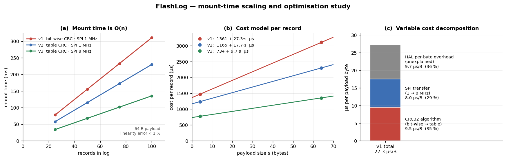
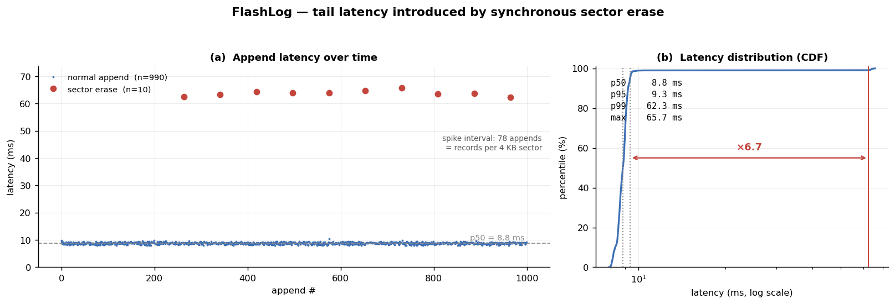

# FlashLog
 
STM32 + FreeRTOS + SPI NOR Flash 上的 append-only 日誌儲存韌體，
具備 CRC32 完整性驗證、斷電自動復原與環形空間回收。
 
 
## 功能
 
- **Append-only log** — record 不跨 sector 邊界，尾端以 PAD record 填補
- **斷電復原** — 開機掃描重建狀態，CRC 驗證可偵測寫入中斷的半殘 record
- **環形回收** — 寫滿後回收最舊 sector；另提供 STOP 模式（滿了即停、不丟資料）
- **磨損統計** — 各 sector 擦除次數，以 append-only 事件持久化
- **雙 task 架構** — CommandTask / StorageTask 經 queue 分派，flash 為 single-owner
- **Host CLI** — Python 工具支援自動化測試、benchmark 與 CSV 輸出
## 平台
 
| | |
|---|---|
| MCU 板 | STM32 Nucleo-F446RE |
| Flash | SPI NOR 16 MB |
| RTOS | FreeRTOS（CMSIS-RTOS v2） |
| 工具鏈 | STM32CubeMX + STM32CubeIDE |
 
### 接線
 
| Flash | Nucleo（Arduino 排針） |
|---|---|
| VCC | `3V3` |
| GND | `GND` |
| CS | `PWM/CS/D10` |
| DI | `PWM/MOSI/D11` |
| DO | `MISO/D12` |
| CLK | `SCK/D13` |
 
> `DO`→MISO、`DI`→MOSI 是輸出對輸入的交叉接法。
 
## Flash Layout
 
```
0x000000  metadata sector    磨損統計（append-only 事件，4 B/筆）
0x001000  log 區 16 × 4 KB   環形使用，寫滿回收最舊 sector
 
record = header(20 B) + payload(≤64 B)
header = magic | rec_id | length | reserved | timestamp | crc32
```
 
抹除後的 flash 為全 `FF`，而 magic 不可能是 `0xFFFFFFFF`
——**第一個讀到 FF 的位置就是 log 尾端**，因此 write pointer 不需另外儲存。
 
## 使用
 
序列埠 `115200 8-N-1`：
 
```
FlashLog> help
  id | erase <addr> | write <addr> <text> | read <addr> <len>
  log write <text>       | log read <id>
  log dump [start] [cnt] | log stats
  log format | log remount
  log wear   | log wearreset
  log corrupt | log partial <text>      # 故障注入，用於驗證復原機制
```
 
Host CLI：
 
```bash
pip install pyserial
cd tools
 
python flashlog.py --port COM3 write hello
python flashlog.py dump
python flashlog.py wear
 
# 量測與產圖
python flashlog.py benchmark --count 1000 --size 32 --csv data/latency.csv
python flashlog.py scaling --max 200 --step 25 --csv data/scaling.csv
python plot_gc_latency.py --csv data/gc_latency_full.csv --out ../docs/gc_latency.png
```
 
每個指令的回應皆以 `OK` 或 `ERR <code>` 結尾，供工具判斷完成時機。
 
## 量測結果
 
數據由韌體端 DWT cycle counter（62.5 ns 解析度）量測，經 host CLI 收集為 CSV。
 
### Mount 成本與優化
 

 
Mount 時間隨 record 數線性成長，成本模型 `t ≈ n × (734 + 9.7s) µs`（s = payload bytes）。
 
兩輪優化將變動成本降低 **64%**（27.3 → 9.7 µs/B）：CRC32 改查表法（−35%）、
SPI 時脈 1→8 MHz（−29%）。剩餘 9.7 µs/B 中實際傳輸僅佔 1 µs，
其餘推測為 HAL 的 per-byte 開銷。
 
### GC 造成的 tail latency
 

 
log 寫滿後量測 1000 次 append（payload 32 B）：
 
| p50 | p95 | **p99** | max | mean |
|---|---|---|---|---|
| 8.82 ms | 9.35 ms | **62.29 ms** | 65.70 ms | 9.34 ms |
 
尖峰來自同步的 sector 擦除（實測 54.9 ms），出現 10 次、**間隔精確為 78 筆**
——正好是一個 4 KB sector 能容納的 record 數（4096 / 52）。
注意 mean 幾乎等於 p50，完全掩蓋了這個長尾。
 
### 磨損分布
 
連續寫入 4000 筆後，16 個 sector 的擦除次數為 5 / 3 兩種值（spread = 2）。
環形回收使擦除嚴格輪序，單次連續運轉下 spread 必然 ≤ 1。
 
## 已知限制
 
- **Mount 為 O(n)** — 1593 筆需 1.86 s；根本解法是建立索引，效能優化只能改善常數項
- **GC 的 62 ms 長尾** — 消除它需實作 Erase Suspend，而非單純改用背景 task
- `log_format` 固定從 S0 開始，反覆 format 會使前段 sector 磨損較快
## 專案結構
 
```
Core/Src/   flash.c  log.c  crc32.c  wear.c  log_uart.c  cmd.c  perf.c  main.c
tools/      flashlog.py（host CLI）  plot_*.py（繪圖）  data/（量測 CSV）
docs/       量測圖表
```
 
| Tag | 內容 |
|---|---|
| `v0.1-pre-gc` | append-only log、CRC recovery、DWT profiling |
| `v0.2-gc` | 環形回收、磨損統計、tail latency 分析 |
